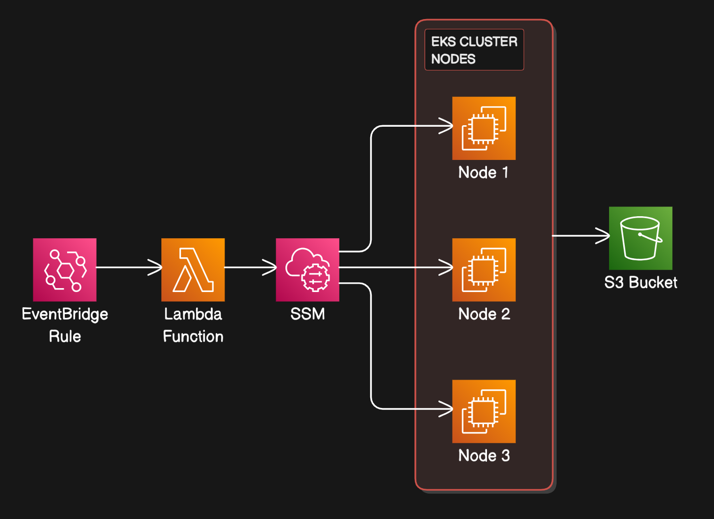

---

# EKS Log Collector and Archival Automation

This project automates the collection of logs from Amazon EKS cluster worker nodes and archives them into an Amazon S3 bucket. The solution leverages several AWS services—including AWS Lambda, EventBridge, and AWS Systems Manager (SSM)—to run log collection scripts on EC2 instances and store the resulting log bundles in S3.

> **Note:**  
> For testing purposes, the EventBridge rule can be configured to trigger within minutes. 

## Architecture



## Overview

- **AWS Lambda Function:**  
  The Lambda function is responsible for:
  - Retrieving environment variables (e.g., cluster name, S3 bucket name).
  - Determining the target EC2 instance (which are part of your EKS cluster).
  - Sending an SSM command that executes a log collector script on the target instance.
  - The log collector script downloads, executes, and then uploads the log bundle to the specified S3 bucket.
  
- **EventBridge Rule:**  
  A scheduled EventBridge rule triggers the Lambda function.

- **AWS Systems Manager (SSM):**  
  SSM is used to run commands on the EC2 instances (EKS worker nodes) to collect logs and upload them to S3.

- **Amazon S3 Bucket:**  
  A dedicated S3 bucket is created to store the log bundles. In production, you can also define a lifecycle policy on the bucket to automatically delete old log files.


## Prerequisites

- An existing Amazon EKS cluster with worker nodes (EC2 instances) tagged appropriately (e.g., `eks:cluster-name`).
- AWS CLI configured with appropriate permissions.
- Python 3.8+ and the `boto3` package installed.
- For local testing, you can use the `python-dotenv` package to load environment variables from a `.env` file.

## Deployment

### Using boto3 (Programmatic Deployment)

The project includes a Python script that:
1. Creates an S3 bucket.
2. Creates an EventBridge rule that triggers on a specified schedule.
3. Deploys the Lambda function along with its IAM role and required environment variables.

The Lambda function code (packaged as a ZIP file) is uploaded with the environment variables (e.g., `CLUSTER_NAME` and `S3_BUCKET`) set in the `Environment` parameter of the `create_function` API call.

### Example Snippet for Lambda Creation

```python
response = lambda_client.create_function(
    FunctionName="eks-log-collector",
    Runtime="python3.8",
    Role=role["Role"]["Arn"],
    Handler="lambda_function.lambda_handler",
    Code={"ZipFile": lambda_code_bytes},
    Timeout=300,
    MemorySize=256,
    Environment={
        "Variables": {
            "CLUSTER_NAME": "your-cluster-name",
            "S3_BUCKET": "your-s3-bucket"
        }
    }
)
```

## How It Works

1. **Lambda Execution:**  
   When triggered by the EventBridge rule, the Lambda function retrieves the `CLUSTER_NAME` and `S3_BUCKET` from its environment variables.

2. **SSM Command Execution:**  
   The Lambda function determines the target instance ID (e.g., from the instance_id retrieval function) and then builds an SSM command list that:
   - Retrieves the instance metadata.
   - Executes a log collector script.
   - Uploads the log bundle to S3, naming the file with the instance ID.
   
3. **Log Upload:**  
   The EC2 instance runs the script, collects logs, and uploads the resulting archive to the specified S3 bucket.

## Testing & Validation

- **Local Testing:**  
  Use the `python-dotenv` package and a local `.env` file to simulate environment variables when testing your code locally and to create some of the required resources.

- **Production Testing:**  
  Deploy the solution using your preferred IaC tool (CloudFormation, SAM, Terraform) and adjust the EventBridge rule schedule as needed.

